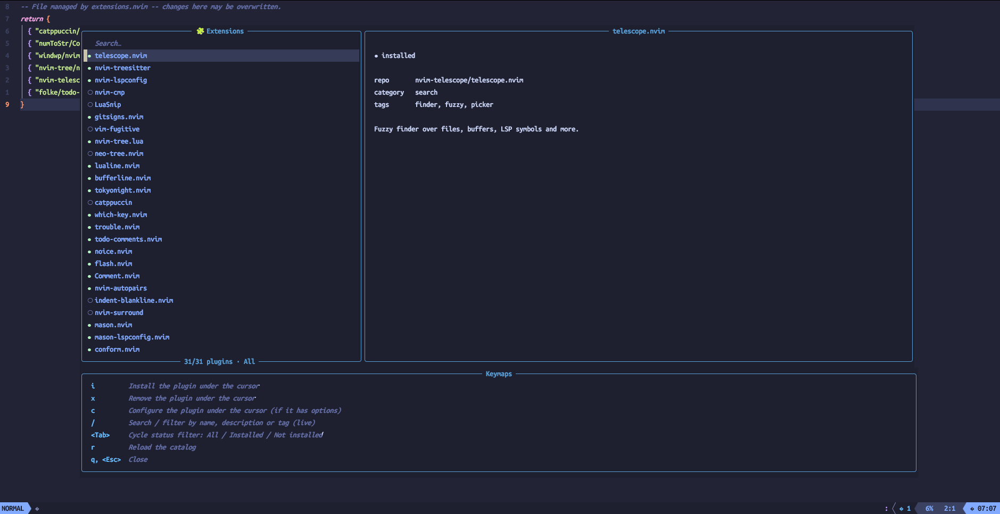

# extensions.nvim

A VSCode-like "Extensions" panel for Neovim: browse a catalog of plugins,
search/filter it, view details, and install or remove plugins with a
keypress — backed by [lazy.nvim](https://github.com/folke/lazy.nvim) and
built with [nui.nvim](https://github.com/MunifTanjim/nui.nvim).

> **Status: MVP.** Static bundled catalog, single backend (`lazy.nvim`), no
> remote plugin data yet. See [Roadmap](#roadmap).



## Requirements

- Neovim >= 0.9.0
- [lazy.nvim](https://github.com/folke/lazy.nvim)
- [nui.nvim](https://github.com/MunifTanjim/nui.nvim)

## Installation

```lua
-- lua/plugins/extensions.lua
return {
  "DevDanielAlvarez/Extensions.Nvim",
  dependencies = { "MunifTanjim/nui.nvim" },
  cmd = "Extensions",
  opts = {},
}
```

## Usage

Run `:Extensions` to open the panel: a centered floating window with a
search bar and plugin list on the top-left, a live details preview on the
top-right that updates as you move the cursor, and a keymap reference panel
docked along the bottom — all visible from the moment it opens.

| Key         | Action                                                |
| ----------- | ------------------------------------------------------ |
| `i`         | Install the plugin under the cursor                     |
| `x`         | Remove the plugin under the cursor                      |
| `c`         | Configure the plugin under the cursor (if it has options) |
| `/`         | Focus the search bar and filter live as you type         |
| `<Tab>`     | Cycle status filter: All / Installed / Not installed     |
| `r`         | Reload the catalog                                       |
| `q`/`<Esc>` | Close                                                    |

## How installs work

extensions.nvim never edits your own config files. It owns a single spec
file, `lua/plugins/extensions-nvim.lua`, which `lazy.nvim` imports like any
other plugin module. Installing adds an entry there and asks `lazy.nvim` to
install it; removing deletes the entry and runs the equivalent of
`:Lazy clean`. Whether a catalog plugin shows as "installed" is read
directly from `lazy.nvim`'s own registry, so plugins you installed some
other way are recognized too.

## Configuring a plugin

Catalog entries can declare a `config` schema — a list of options a plugin
supports, each with an `input_type` (`toggle`, `int`, or `string`). Press
`c` on an **installed** plugin that has one to open a small popup: toggles
flip with `<CR>`/`<Space>`, `int`/`string` fields open an inline editor on
`<CR>`. Every change is saved immediately into that plugin's entry in
`lua/plugins/extensions-nvim.lua`, as a normal `opts = { ... }` table —
the same field `lazy.nvim` already knows how to pass to `require(x).setup(opts)`.

Most plugins only apply `opts` once at load time, so changes may need
`:Lazy reload <plugin>` or a Neovim restart to actually take effect —
extensions.nvim tells you this after saving.

## Adding a plugin to the catalog (for plugin authors / contributors)

The catalog is a plain JSON file at [`data/catalog.json`](data/catalog.json)
— a JSON array, one object per plugin. Adding your plugin (or fixing an
existing entry) is a normal PR against that file; no code changes needed.

### Minimal entry

```json
{
  "repo": "user/repo",
  "name": "your-plugin.nvim",
  "description": "One sentence describing what it does.",
  "category": "editing",
  "tags": ["tag1", "tag2"]
}
```

| Field         | Type       | Notes                                                        |
| ------------- | ---------- | -------------------------------------------------------------|
| `repo`        | `string`   | `"user/repo"`, exactly as `lazy.nvim` expects it.             |
| `name`        | `string`   | Display name in the list and popups.                         |
| `description` | `string`   | One sentence, shown in the details preview.                  |
| `category`    | `string`   | Free text for now (e.g. `"lsp"`, `"ui"`, `"git"`, `"editing"`). |
| `tags`        | `string[]` | Matched by the live search bar, alongside name/description.  |

### Making your plugin configurable

If your plugin has simple `opts` a user might want to flip on the fly,
add a `config` array. Each item is one option, rendered as one row in the
`c` popup:

```json
{
  "repo": "user/repo",
  "name": "your-plugin.nvim",
  "description": "One sentence describing what it does.",
  "category": "editing",
  "tags": ["tag1"],
  "config": [
    { "key": "enabled", "input_type": "toggle", "input_name": "Enable feature X", "default": true },
    { "key": "max_items", "input_type": "int", "input_name": "Max items shown", "default": 10 },
    { "key": "prefix", "input_type": "string", "input_name": "Prompt prefix", "default": "> " }
  ]
}
```

| Field        | Type                             | Notes                                                              |
| ------------ | --------------------------------- | ------------------------------------------------------------------|
| `key`        | `string`                          | Must match a **top-level** key in the option table your plugin's `setup()`/`opts` accepts — extensions.nvim writes it straight into `opts.<key>` in the generated `lazy.nvim` spec. Nested options (e.g. `scope.enabled`) aren't supported yet. |
| `input_type` | `"toggle"` \| `"int"` \| `"string"` | Picks the input widget: `toggle` is a flip-with-one-keypress boolean, `int` and `string` open an inline text editor. |
| `input_name` | `string`                          | Label shown next to the value in the popup.                        |
| `default`    | `boolean` \| `number` \| `string`  | Must match `input_type` (boolean for `toggle`, number for `int`, string for `string`). Shown until the user overrides it. |

`config` is entirely optional — omit it if your plugin doesn't need one,
or you're not sure what's worth exposing yet.

### Trying it out before opening a PR

Point `catalog_path` at your own draft file instead of editing the bundled
one directly, so you can iterate without touching `data/catalog.json`
until you're happy with it:

```lua
require("extensions").setup({
  catalog_path = "/path/to/your/draft-catalog.json",
})
```

Then run `:Extensions`, find your entry (`/` to search by name), install
it, and press `c` to confirm the config popup renders and saves the way
you expect.

## Configuration

```lua
require("extensions").setup({
  catalog_path = nil, -- path to a JSON file (same shape as data/catalog.json) with a custom catalog
})
```

See `:help extensions.nvim` for the full catalog item shape (including the
`config` field) and all options.

## Roadmap

- [ ] Dynamic/remote catalog (GitHub search API or similar), with caching
- [ ] Render each plugin's README in the detail panel
- [ ] Enable/disable toggle distinct from install/remove
- [ ] "Update available" indicator
- [ ] Support additional backends (`mini.deps`, `vim.pack`)
- [ ] Category/tag filter UI
- [ ] More `input_type`s in the config builder (e.g. select/enum, float)

## Prior art

[store.nvim](https://github.com/alex-popov-tech/store.nvim) already solves
plugin discovery/install very well with a large, hourly-updated database.
extensions.nvim is a smaller, VSCode-UX-focused take on the same idea.

## License

MIT
